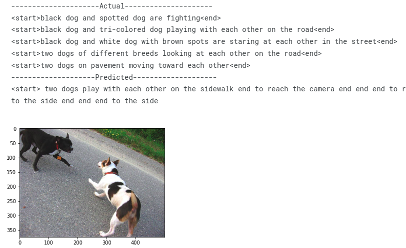

# Image-Captioning
## Dataset = https://www.kaggle.com/datasets/adityajn105/flickr8k
In this project we will extract Image features and Language features seperately by using Deep Learning techniques and NLP feature extraction respectively. At the end integrating these 2 features using an LSTM based encoder decoder model to generate the final result.

